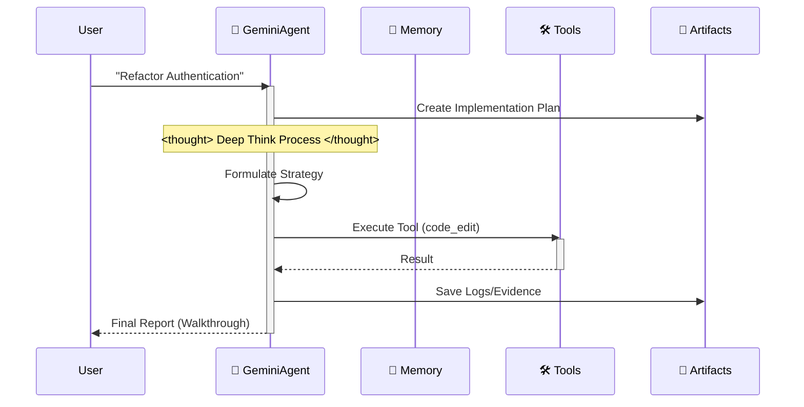

# 🪐 Google Antigravity Workspace Template (Enterprise Edition)


Welcome to the **Antigravity Workspace Template**. This is a production-grade starter kit for building autonomous agents on the Google Antigravity platform, fully compliant with **Antigravity Official Documentation**—and proudly "Anti-LangChain" thanks to its minimal, transparent architecture.

## ⚡️ Why Antigravity?

Stop fighting with frameworks. Antigravity is a scaffold, not a library.

| Feature | Traditional Frameworks (LangChain/Swarm) | Antigravity Scaffold |
| :--- | :--- | :--- |
| **Dependencies** | 📦 **Bloated**: Hundreds of MBs, dependency hell. | 🪶 **Zero-Bloat**: Only `google-genai` and standard lib. |
| **Debuggability** | 🕸️ **Black Box**: 10 layers of abstraction. | 🔍 **Transparent**: Pure Python, you see every line. |
| **Control** | 🤖 **Passive**: You follow their paradigm. | 🕹️ **Active**: You own the `Think-Act` loop. |

## 🧠 Core Philosophy: Artifact-First

This workspace enforces the **Artifact-First** protocol. The Agent does not just write code; it produces tangible outputs (Artifacts) for every complex task.

1. **Planning**: `artifacts/plan_[task_id].md` is created before coding.
2. **Evidence**: Logs and test outputs are saved to `artifacts/logs/`.
3. **Visuals**: UI changes generate screenshot artifacts.

## 🛸 How It Works

The agent follows a strict "Think-Act-Reflect" loop, simulating the cognitive process of Gemini 3.



## 🔥 Killer Features

- 🧠 **Infinite Memory Engine**: Recursive summarization automatically compresses history. Context limits are a thing of the past.
- 🛠️ **Universal Tool Protocol**: Generic ReAct pattern. Just register any Python function in `available_tools`, and the Agent learns to use it.
- ⚡️ **Gemini Native**: Optimized for Gemini 2.0 Flash's speed and function calling capabilities.

## 🚀 Quick Start

### Local Development
1. **Install Dependencies**:
    ```bash
    pip install -r requirements.txt
    ```
2. **Run the Agent**:
    ```bash
    python src/agent.py
    ```

### Docker Deployment
1. **Build & Run**:
    ```bash
    docker-compose up --build
    ```

## 📂 Project Structure

```
.
├── .antigravity/       # 🛸 Official Antigravity Config
│  └── rules.md        # Agent Rules & Permissions
├── artifacts/          # 📂 Agent Outputs (Plans, Logs, Visuals)
├── .context/           # AI Knowledge Base
├── .github/            # CI/CD Workflows
├── src/                # Source Code
│  ├── agent.py        # Main Agent Logic
│  ├── config.py       # Settings Management
│  ├── memory.py       # JSON Memory Manager
│  └── tools/          # Agent Tools
├── tests/              # Test Suite
├── .cursorrules        # Compatibility Pointer
├── Dockerfile          # Production Build
├── docker-compose.yml  # Local Dev Setup
└── mission.md          # Agent Objective
```

## 🚀 The "Zero-Config" Workflow

Stop writing long system prompts. This workspace pre-loads the AI's cognitive architecture for you.

### Step 1: Clone & Rename (The "Mold")
Treat this repository as a factory mold. Clone it, then rename the folder to your project name.
```bash
git clone https://github.com/study8677/antigravity-workspace-template.git my-agent-project
cd my-agent-project
# Now you are ready. No setup required.
```

### Step 2: The Magic Moment ⚡️
Open the folder in Cursor or Google Antigravity.
- 👀 **Watch**: The IDE automatically detects `.cursorrules`.
- 🧠 **Load**: The AI silently ingests the "Antigravity Expert" persona from `.antigravity/rules.md`.

### Step 3: Just Prompt (No Instructions Needed)
You don't need to tell the AI to "be careful" or "use the src folder". It's already brainwashed to be a Senior Engineer.

**Old Way (Manual Prompting)**:
> "Please write a snake game. Make sure to use modular code. Put files in src. Don't forget comments..."

**The Antigravity Way**:
> "Build a snake game."

The AI will automatically:
1. 🛑 **Pause**: "According to protocols, I must plan first."
2. 📄 **Document**: Generates `artifacts/plan_snake.md`.
3. 🔨 **Build**: Writes modular code into `src/game/` with full Google-style docstrings.

## 🗺️ Roadmap

- [x] **Phase 1: Foundation** (Scaffold, Config, Memory)
- [x] **Phase 2: DevOps** (Docker, CI/CD)
- [x] **Phase 3: Antigravity Compliance** (Rules, Artifacts)
- [x] **Phase 4: Advanced Memory** (Summary Buffer Implemented ✅)
- [x] **Phase 5: Cognitive Architecture** (Generic Tool Dispatch Implemented ✅)
