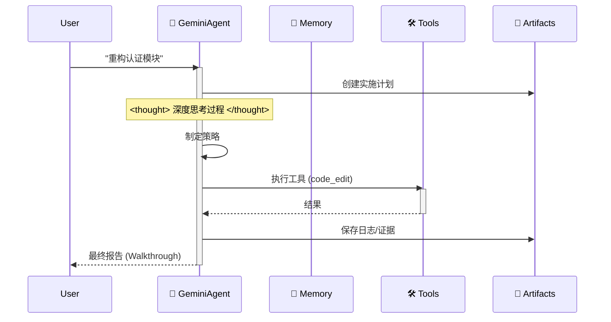

# 🪐 Google Antigravity 工作区模板（企业版）


欢迎使用 **Antigravity 工作区模板**。这是一个生产级的入门套件，用于在 Google Antigravity 平台上构建自主 Agent，完全符合 **Antigravity 官方文档**——并以极简、透明的架构自豪地成为 “Anti-LangChain”。

## ⚡️ 为什么选择 Antigravity？

别再和复杂框架搏斗。Antigravity 是脚手架，不是库。

| 特性 | 传统框架（LangChain/Swarm） | Antigravity 脚手架 |
| :--- | :--- | :--- |
| **依赖** | 📦 **臃肿**：动辄数百 MB，依赖地狱。 | 🪶 **零臃肿**：仅需 `google-genai` + 标准库。 |
| **可调试性** | 🕸️ **黑盒**：10 层抽象，排查艰难。 | 🔍 **透明**：纯 Python，每一行都看得见。 |
| **控制力** | 🤖 **被动**：必须跟随它们的范式。 | 🕹️ **主动**：你掌控 `Think-Act` 循环。 |

## 🧠 核心理念：Artifact-First（产物优先）

本工作区强制执行 **Artifact-First** 协议。Agent 不仅写代码；它会为每个复杂任务产出可验证的 Artifact。

1. **规划**：在编码前先创建 `artifacts/plan_[task_id].md`。
2. **证据**：日志与测试输出保存到 `artifacts/logs/`。
3. **视觉**：UI 变更会生成截图产物。

## 🛸 工作原理

Agent 遵循严格的 “Think-Act-Reflect” 循环，模拟 Gemini 3 的认知过程。



## 🔥 杀手级特性

- 🧠 **无限记忆引擎**：递归式摘要自动压缩历史，打破上下文限制。
- 🛠️ **通用工具协议**：通用 ReAct 模式。把任意 Python 函数注册到 `available_tools`，Agent 即可学会调用。
- ⚡️ **Gemini 原生**：针对 Gemini 2.0 Flash 的速度与函数调用能力做了优化。

## 🚀 快速开始

### 本地开发
1. **安装依赖**：
    ```bash
    pip install -r requirements.txt
    ```
2. **运行 Agent**：
    ```bash
    python src/agent.py
    ```

### Docker 部署
1. **构建并运行**：
    ```bash
    docker-compose up --build
    ```

## 📂 项目结构

```
.
├── .antigravity/       # 🛸 官方 Antigravity 配置
│  └── rules.md        # Agent 规则与权限
├── artifacts/          # 📂 Agent 产物（计划、日志、视觉）
├── .context/           # AI 知识库
├── .github/            # CI/CD 工作流
├── src/                # 源代码
│  ├── agent.py        # Agent 主逻辑
│  ├── config.py       # 设置管理
│  ├── memory.py       # JSON 记忆管理
│  └── tools/          # Agent 工具
├── tests/              # 测试套件
├── .cursorrules        # 兼容性指针
├── Dockerfile          # 生产环境构建
├── docker-compose.yml  # 本地开发配置
└── mission.md          # Agent 目标
```

## 🚀 “零配置” 工作流

停止撰写冗长的系统提示。本工作区已预加载 AI 的认知架构。

### 第一步：克隆与重命名（“模具”）
将此仓库视为工厂模具。克隆后将文件夹重命名为你的项目名称。
```bash
git clone https://github.com/study8677/antigravity-workspace-template.git my-agent-project
cd my-agent-project
# 现在你已准备就绪，无需额外设置。
```

### 第二步：魔法时刻 ⚡️
在 Cursor 或 Google Antigravity 中打开文件夹。
- 👀 **观察**：IDE 自动检测 `.cursorrules`。
- 🧠 **加载**：AI 静默摄取 `.antigravity/rules.md` 中的 “Antigravity Expert” 人格。

### 第三步：直接提示（无需额外指令）
你无需提醒 AI “注意” 或 “使用 src 目录”。它已被预设为高级工程师。

**旧方式（手动提示）**：
> “写一个贪吃蛇游戏，确保模块化，放在 src 里，别忘了注释……”

**Antigravity 方式**：
> “构建一个贪吃蛇游戏。”

AI 会自动：
1. 🛑 **暂停**：“根据协议，我必须先规划。”
2. 📄 **文档**：生成 `artifacts/plan_snake.md`。
3. 🔨 **构建**：将模块化代码写入 `src/game/`，附完整 Google 风格文档字符串。

## 🗺️ 路线图

- [x] **阶段 1：基础**（脚手架、配置、记忆）
- [x] **阶段 2：DevOps**（Docker、CI/CD）
- [x] **阶段 3：Antigravity 合规**（规则、产物）
- [x] **阶段 4：高级记忆**（摘要缓冲实现 ✅）
- [x] **阶段 5：认知架构**（通用工具分发实现 ✅）
