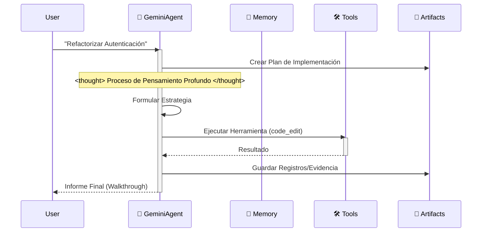

# 🪐 Plantilla de Espacio de Trabajo Google Antigravity (Edición Empresarial)


Bienvenido a la **Plantilla de Espacio de Trabajo Antigravity**. Es un kit de inicio de nivel producción para construir agentes autónomos en la plataforma Google Antigravity, totalmente alineado con la **Documentación Oficial de Antigravity** y orgullosamente “Anti-LangChain” por su arquitectura mínima y transparente.

## ⚡️ ¿Por qué Antigravity?

Deja de pelear con frameworks. Antigravity es un andamiaje, no una librería.

| Característica | Frameworks Tradicionales (LangChain/Swarm) | Andamiaje Antigravity |
| :--- | :--- | :--- |
| **Dependencias** | 📦 **Inflado**: Cientos de MB, infierno de dependencias. | 🪶 **Cero-bloat**: Solo `google-genai` y librería estándar. |
| **Depurabilidad** | 🕸️ **Caja negra**: 10 capas de abstracción. | 🔍 **Transparente**: Python puro, ves cada línea. |
| **Control** | 🤖 **Pasivo**: Sigues su paradigma. | 🕹️ **Activo**: Tú controlas el bucle `Think-Act`. |

## 🧠 Filosofía Central: Artifact-First (Artefacto-Primero)

Este espacio de trabajo impone el protocolo **Artifact-First**. El Agente no solo escribe código; produce artefactos tangibles para cada tarea compleja.

1. **Planificación**: Se crea `artifacts/plan_[task_id].md` antes de codificar.
2. **Evidencia**: Los registros y salidas se guardan en `artifacts/logs/`.
3. **Visuales**: Los cambios de UI generan capturas como artefactos.

## 🛸 Cómo Funciona

El agente sigue un bucle estricto de “Pensar-Actuar-Reflexionar”, simulando el proceso cognitivo de Gemini 3.



## 🔥 Funciones Asesinas

- 🧠 **Motor de Memoria Infinita**: La resumición recursiva comprime el historial automáticamente; los límites de contexto dejan de ser un problema.
- 🛠️ **Protocolo Universal de Herramientas**: Patrón ReAct genérico. Registra cualquier función de Python en `available_tools` y el Agente sabrá usarla.
- ⚡️ **Nativo de Gemini**: Optimizado para la velocidad y las llamadas a funciones de Gemini 2.0 Flash.

## 🚀 Inicio Rápido

### Desarrollo Local
1. **Instalar dependencias**:
    ```bash
    pip install -r requirements.txt
    ```
2. **Ejecutar el Agente**:
    ```bash
    python src/agent.py
    ```

### Despliegue con Docker
1. **Construir y ejecutar**:
    ```bash
    docker-compose up --build
    ```

## 📂 Estructura del Proyecto

```
.
├── .antigravity/       # 🛸 Configuración Oficial de Antigravity
│  └── rules.md        # Reglas y Permisos del Agente
├── artifacts/          # 📂 Salidas del Agente (Planes, Registros, Visuales)
├── .context/           # Base de Conocimiento de IA
├── .github/            # Flujos de Trabajo CI/CD
├── src/                # Código Fuente
│  ├── agent.py        # Lógica Principal del Agente
│  ├── config.py       # Gestión de Configuraciones
│  ├── memory.py       # Gestor de Memoria JSON
│  └── tools/          # Herramientas del Agente
├── tests/              # Suite de Pruebas
├── .cursorrules        # Puntero de Compatibilidad
├── Dockerfile          # Construcción de Producción
├── docker-compose.yml  # Configuración de Desarrollo Local
└── mission.md          # Objetivo del Agente
```

## 🚀 Flujo de Trabajo “Cero-Configuración”

Deja de escribir largos prompts del sistema. Este espacio de trabajo precarga la arquitectura cognitiva de la IA por ti.

### Paso 1: Clonar y Renombrar (El “Molde”)
Trata este repositorio como un molde de fábrica. Clónalo y renombra la carpeta con el nombre de tu proyecto.
```bash
git clone https://github.com/study8677/antigravity-workspace-template.git my-agent-project
cd my-agent-project
# Ahora estás listo. No se requiere configuración.
```

### Paso 2: El Momento Mágico ⚡️
Abre la carpeta en Cursor o Google Antigravity.
- 👀 **Observa**: El IDE detecta automáticamente `.cursorrules`.
- 🧠 **Carga**: La IA ingiere silenciosamente la personalidad “Experto en Antigravity” desde `.antigravity/rules.md`.

### Paso 3: Solo Pregunta (Sin Instrucciones Extras)
No necesitas decirle a la IA que “tenga cuidado” o “use la carpeta src”. Ya está programada para ser un Ingeniero Senior.

**Forma Antigua (Prompting Manual)**:
> “Por favor escribe un juego de la serpiente. Asegúrate de usar código modular. Pon los archivos en src. No olvides los comentarios…”

**La Forma Antigravity**:
> “Construye un juego de la serpiente.”

La IA automáticamente:
1. 🛑 **Pausa**: “Según los protocolos, debo planificar primero.”
2. 📄 **Documenta**: Genera `artifacts/plan_snake.md`.
3. 🔨 **Construye**: Escribe código modular en `src/game/` con docstrings completos estilo Google.

## 🗺️ Hoja de Ruta

- [x] **Fase 1: Fundación** (Andamiaje, Configuración, Memoria)
- [x] **Fase 2: DevOps** (Docker, CI/CD)
- [x] **Fase 3: Cumplimiento Antigravity** (Reglas, Artefactos)
- [x] **Fase 4: Memoria Avanzada** (Buffer de Resumen Implementado ✅)
- [x] **Fase 5: Arquitectura Cognitiva** (Despacho Genérico de Herramientas Implementado ✅)
